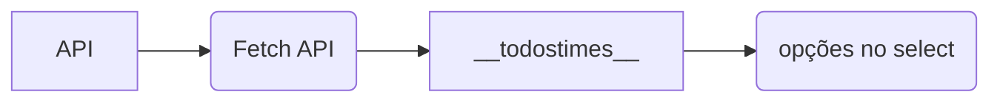

# RESOLUÇÃO DA QUESTÃO 3

> 3\. Fazer uma requisição para a API e exibir todos os jogos de uma equipe específica.

## Criação do aba de seleção de um time

Primeiro, definimos uma marca select no documento html onde serão colocados as opções:

```html linenums="34"
<select id="equipe" onchange="buscarJogos()">
        <option value="">Selecione um time...</option>
```

Em seguida, a parte do script onde será colocado as opções, para isso foi necessário fazer uma requisição ```GET``` da API com os times.

```js linenums="1" hl_lines="17"
const url_teams = 'https://worldcupjson.net/teams' //URL dos times

fetch(url_teams) //Pegar as info da URL Times
    .then(response => response.json())
    .then(teams => todostimes(teams))

function todostimes(teams){

    let equipes = document.getElementById('equipe') 

    for (let team of teams['groups']){ //Percorrer a lista

        for (let country of team.teams){ //Percorrer a lista dentro da lista para pegar o nomes dos times

                let opção = new Option(country.name, country.name) //adicionar opção
                console.log(country.name)
                equipes.options[equipes.options.length] = opção
        }
    }
}
```



> Detalhe importante: Na linha 17, usa-se uma atribuição direta no options, o método push não é possível, pois o ```select.options``` é um prototype HTMLOptionsCollection  e não um Prototype Array. Outra solução possível é usar o método add, inerente aos Objects.  
  
## Exibição dos jogos

Depois de criarmos a tabela de seleção e suas opções (times), criamos uma função que exibe o jogo na página HTML, sua execução depende da propriedade ```onchange``` do Select.

```js linenums="24"
function buscarJogos() { //função de mostrar os jogos

    const nomeEquipe = document.getElementById('equipe').value //nome da equipe

    console.log(nomeEquipe) //consolelog

    if (!nomeEquipe) { //em caso de erro
        document.getElementById('resultado').innerHTML = '<p class="error">Por favor, selecione uma equipe.</p>';
        return;
    }
```

Dentro da função, fazemos mais duas requisições, a primeira das bandeiras e a segunda com todas as partidas.

```js linenums="35" hl_lines="17 18 19"
const url_jogos = 'https://worldcupjson.net/matches'; //URL dos jogos
const arq_bandeiras = 'flags.json' //arquivo json das bandeiras
    fetch(arq_bandeiras)//pegar foto das bandeiras do json        
    .then(response => response.json())
    .then(data => {
        const bandeiraUrl = data[nomeEquipe]; //pegar a bandeira de acordo com o nome da equipe
        if (bandeiraUrl) {
            document.getElementById('flag').src = bandeiraUrl;
        } else {
            document.getElementById('flag').src = ''; // Limpa a imagem se a equipe não for encontrada
            alert('Bandeira não encontrada para a equipe especificada.');
        }
    })

    fetch(url_jogos) //pegar info dos jogos
        .then(response => response.json())
        .then(data => {
            const jogosEquipe = data.filter(jogo => { //pegar jogos que foram jogados em casa ou fora de casa do time
                return jogo.home_team.name.toLowerCase().includes(nomeEquipe.toLowerCase()) || jogo.away_team.name.toLowerCase().includes(nomeEquipe.toLowerCase());
            })
```

> O data.filter, como o próprio nome diz, filtra os dados com base no nome da equipe selecionada.

Em seguida o cria-se a string de marcação HTML com informações das partidas de um time específico e são juntadas pelo ```.join()``` depois, são atribuídas ao documento HTML.

```js linenums="57"
const result = jogosEquipe.map(jogo => { //percorre as info dos jogos e coloca em result
    return `
    <div>
        Data: ${new Date(jogo.datetime).toLocaleString('pt-BR')} </br>
        Data: ${jogo.datetime} </br>
        Disputa: ${jogo.home_team.name} x ${jogo.away_team.name} </br>
        Placar: ${jogo.home_team.goals} - ${jogo.away_team.goals} </br>
        Penaltis: ${jogo.home_team.penalties} - ${jogo.away_team.penalties} </br>
        Vencedor: ${jogo.winner} </br>
        Localização: ${jogo.location} </br>
        Estádio: ${jogo.venue} </br>
    </div>
    `
    }).join(''); //adicionar 

    console.log(result)

    document.getElementById('resultado').innerHTML = result //colocar o result no result do html
    
})
```