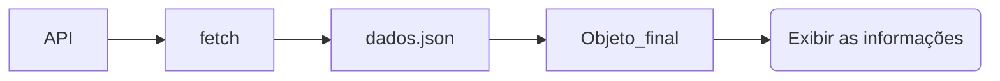

## Requisitando os dados da API

Começamos o código de JAVASCRIPT com a função que o botão do HTML vai chamar e a variável que vai conter o site que utilizamos.  

```js linenums="1"
function resultado() {...code}
```

Fazemos um fetch para requisitar os dados da url, convertemos para jason e colocamos as informações da última partida na função “showfinal”.  

```js linenums="5"
fetch (url) 
.then (response => response.json())  
.then (data => showfinal(data.at(-1))) 
.catch(error => console.error('Erro ao buscar dados:', error)); // trata erros 
```



A função showfinal agora vai utilizar a “data” porém com outro nome, “matches” (utilização de parâmetros).  

```js linenums="11"
function showfinal(match) {...code}
```

Criamos uma variável para pegar o id listapost, este sendo o espaço que vamos exibir os dados no html, e confirmamos que ele está limpo.  
  
```js linenums="12"
const ListaPost = document.getElementById('listapost');
ListaPost.innerHTML = '';
```

Criamos uma variável para converter a string em um objeto date.  

```js linenums="15"
const datetime = new Date(match.datetime)
```

Criamos uma variável que armazena a criação de uma DIV no HTML que terá os detalhes da partida.  
  
```js linenums="17"
const post = document.createElement('div')
```

Foi criada uma formatação padrão para todos os posts no HTML, e com o classname é possível que todos os elementos post fiquem com esse design.  

```js linenums="18"
post.className = 'post'
```

Por fim, definimos todo o conteúdo do HTML na DIV criada, uma boa parte organizada em tabelas linhas e células e anexamos a DIV de classe 'post' e seu conteúdo ao elemento LISTAPOST.  

```js linenums="21"
post.innerHTML = `
        <h2>Campeão: ${match.winner}</h2> <!-- Exibe o campeão -->
        <h2> Vice Campeão: ${match.away_team.name}</h2> <!-- Exibe o vice campeão -->
        <h3>Detalhes da Última Partida:</h3> 
        <p>Data: ${datetime.toLocaleDateString()}</p> <!-- Exibe a data da partida -->
        <p>Hora: ${datetime.toLocaleTimeString()}</p> <!-- Exibe o horário da partida -->
        <p>Localização: Estádio ${match.venue} em ${match.location}</p><br> <!-- Exibe a localização da partida -->
        <h3>Gols e Penalidades:</h3>
                <table> <!-- Inicio da tabela -->
                    <caption>Resumo dos Times</caption> <!-- Titulo da tabela -->
                    <thead> <!-- Cabeçalho da tabela -->
                        <tr>
                            <th>Equipe</th> <!-- Coluna -->
                            <th>Gols</th>
                            <th>Penalidades</th>
                        </tr> <!-- Linha -->
                    </thead>
                    <tbody> <!-- Corpo da tabela -->
                        <tr>
                            <td> ${match.home_team.name}</td>
                            <td>${match.home_team.goals}</td> <!-- Conteúdo do elemento da coluna (célula) -->
                            <td>${match.home_team.penalties}</td>
                        </tr>
                        <tr>
                            <td> ${match.away_team.name}</td>
                            <td>${match.away_team.goals}</td>
                            <td>${match.away_team.penalties}</td>
                        </tr>
                        <tr>
                            <td><strong>Resultado Final</strong></td>
                            <td>${match.home_team.goals} - ${match.away_team.goals}</td>
                            <td>${match.home_team.penalties} - ${match.away_team.penalties}</td>
                        </tr>
                    </tbody> <!-- Finaliza o corpo da tabela -->
                </table> <!-- Finaliza a tabela -->
        <p>Público: ${match.attendance} pessoas</p>
        `

        ListaPost.appendChild(post);
```