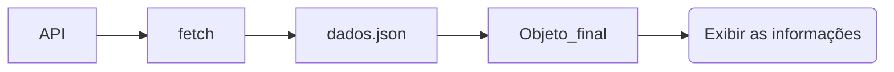

## Requisitando os dados da API

Começamos o código de JAVASCRIPT com a função que o botão do HTML vai chamar e a variável que vai conter o site que utilizamos.  

```js linenums="1"
function resultado() {...code}
```

Fazemos um fetch para requisitar os dados da url, convertemos para jason e colocamos as informações da última partida na função “showfinal”.  

```
fetch (url) 
.then (response => response.json())  
.then (data => showfinal(data.at(-1))) 
.catch(error => console.error('Erro ao buscar dados:', error)); // trata erros 
```



A função showfinal agora vai utilizar a “data” porém com outro nome, “matches” (utilização de parâmetros).  
    
    function showfinal(match) {
        ...code
    }
  
Criamos uma variável para pegar o id listapost, este sendo o espaço que vamos exibir os dados no html, e confirmamos que ele está limpo.  
  
    const ListaPost = document.getElementById('listapost');
    ListaPost.innerHTML = '';


Criamos uma variável para converter a string em um objeto date.  

    const datetime = new Date(match.datetime)

Criamos uma variável que armazena a criação de uma DIV no HTML que terá os detalhes da partida.  
  
Foi criada uma formatação padrão para todos os posts no HTML, e com o classname é possível que todos os elementos post fiquem com esse design.  

Por fim, definimos todo o conteúdo do HTML na DIV criada, uma boa parte organizada em tabelas linhas e células e anexamos a DIV de classe 'post' e seu conteúdo ao elemento LISTAPOST.  